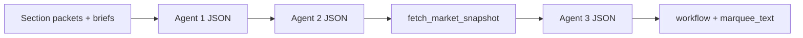
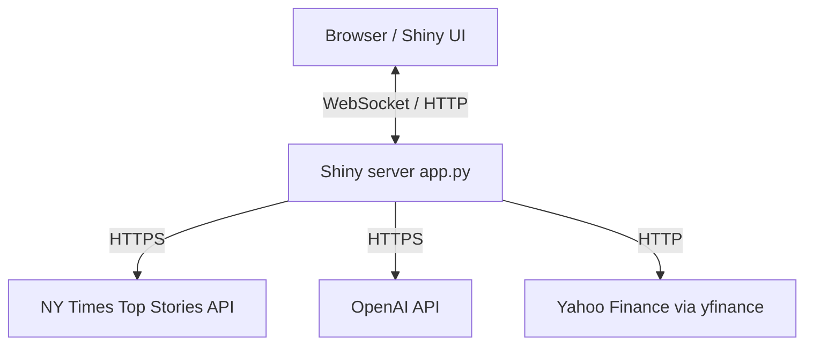
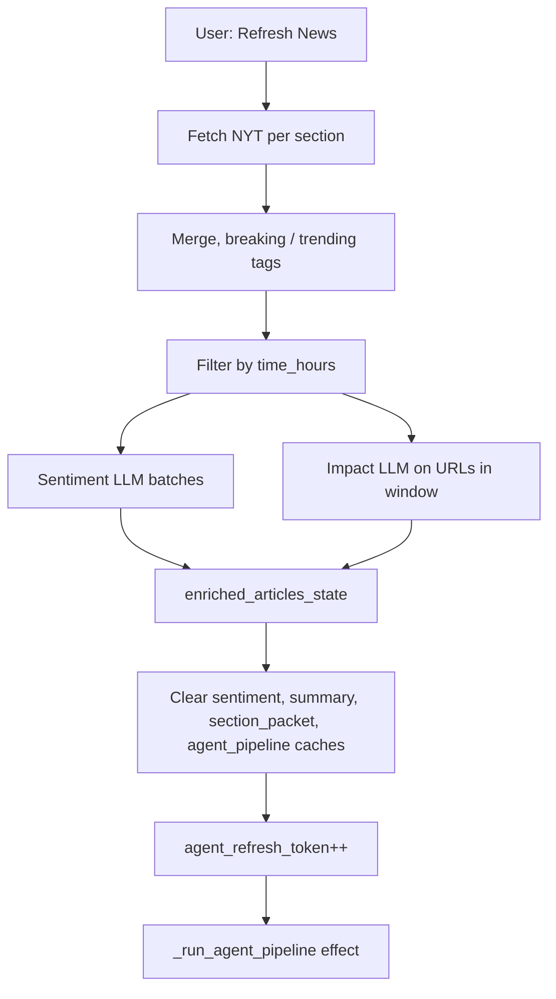
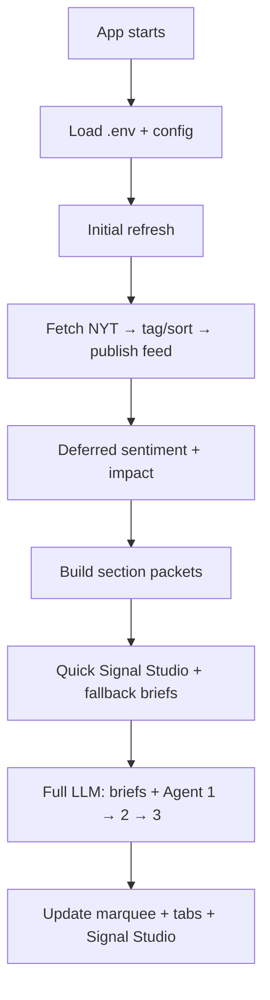
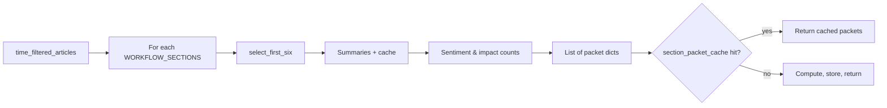
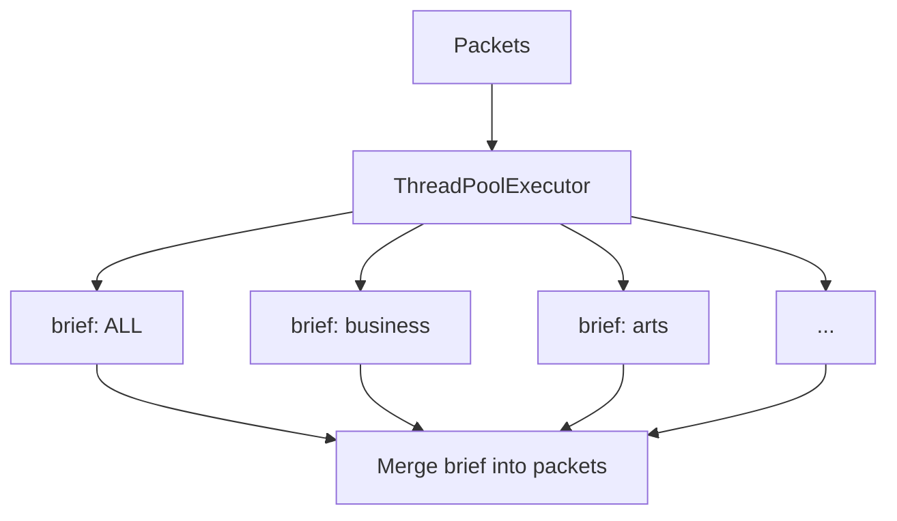
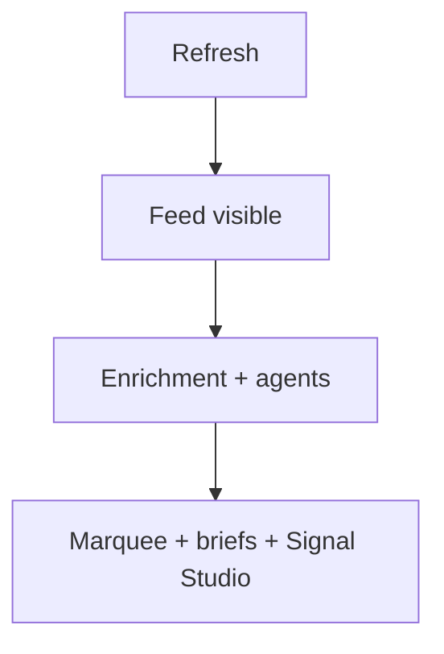
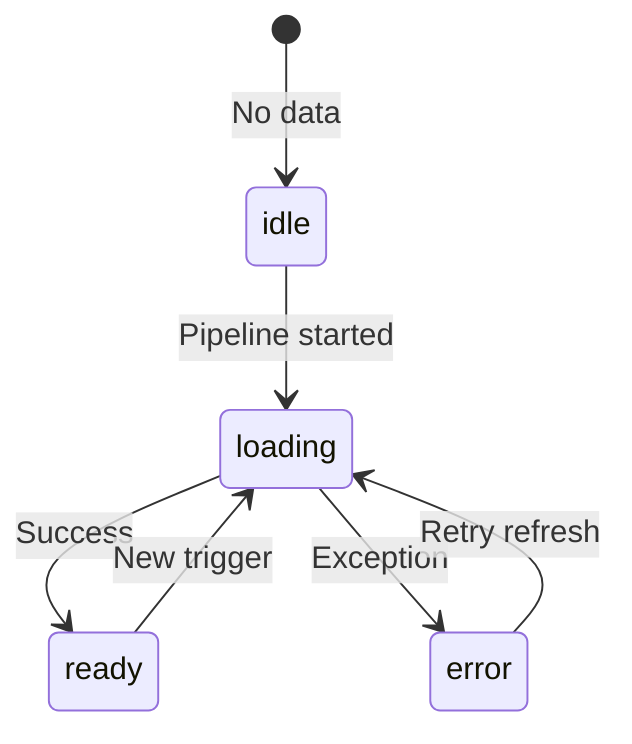
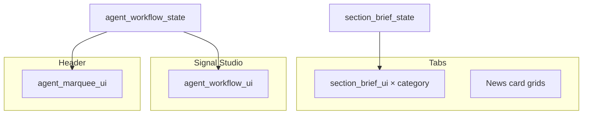

# News for People in a Hurry — Documentation

> **Document version:** 2.2.0  
> **Last updated:** 2026-05-22  
> **App location:** [`AppV1/`](../AppV1/) · **Doc bundle:** [`VERSION.md`](./VERSION.md)

**News for People in a Hurry** (`AppV1/app.py`) is a Shiny for Python news intelligence dashboard. It fetches live **New York Times** Top Stories, ranks and enriches them with AI, runs a multi-agent workflow for cross-section insight and market validation, and presents everything in a fast card-based UI with **Signal Studio** and optional per-article **research briefs**.

Design principle: **show useful content quickly**, then **upgrade intelligence progressively** in the background.

**Stack:** Shiny for Python, pandas, httpx, python-dotenv, uvicorn, **OpenAI Chat Completions** (`config.OPENAI_MODEL`), **yfinance**.

External dependencies: **NYT API**, **OpenAI API**, **yfinance** (Yahoo Finance).

**Signal Studio QC:** Category-level QC scores, composite evidence metrics, marquee quality badges, and a downloadable QC PDF report. Details: [`AppV1/documentation/qc_logic_readme.md`](../AppV1/documentation/qc_logic_readme.md).

---

## Table of contents

**Getting started**

1. [What the app does](#what-the-app-does)
2. [Who it is for](#who-it-is-for)
3. [Quick start](#quick-start)
4. [Using the dashboard](#using-the-dashboard)

**Architecture & pipeline**

5. [Agentic orchestration](#agentic-orchestration)
6. [System context](#system-context)
7. [Runtime stack and configuration](#runtime-stack-and-configuration)
8. [End-to-end lifecycle](#end-to-end-lifecycle)
9. [Core features](#core-features)
10. [Section packets](#section-packets)
11. [Section briefs (parallel)](#section-briefs-parallel)
12. [Multi-agent workflow (serial)](#multi-agent-workflow-serial)
13. [LLM client layer](#llm-client-layer)
14. [Market data](#market-data)
15. [Research brief (Dive Deeper)](#research-brief-dive-deeper)
16. [Shiny reactive pipeline](#shiny-reactive-pipeline)
17. [UI state machine](#ui-state-machine)
18. [Data shapes](#data-shapes)
19. [UI mapping](#ui-mapping)
20. [Caching and resilience](#caching-and-resilience)
21. [Module reference](#module-reference)
22. [Operational notes](#operational-notes)
23. [Diagram index](#diagram-index)
24. [Related documentation](#related-documentation)
25. [Document changelog](#document-changelog)

---

## What the app does

The app:

1. Fetches **NYT Top Stories** across multiple sections (home, business, arts, technology, world, politics).
2. Computes **breaking / trending / latest** ordering and filters by a **time window** (6–48 hours).
3. Enriches rows with **sentiment** and **impact** labels via **OpenAI**, and **AI summaries** with a user-selected **tone** (sidebar).
4. Builds **section packets** (headlines, summaries, counts) for six logical sections plus ALL.
5. Runs **section briefs** and a **three-agent workflow** (cross-section → world mood → market check). The UI can show a quick snapshot first, then refresh when full LLM results are ready.
6. Agent 3 may use **function calling** (`get_market_snapshot`) against live market data, with a fallback path if needed.
7. Renders **news cards** (with pagination), **Global Insight** (header marquee), **per-tab section briefs**, and **Signal Studio** (full agent dashboard).
8. Optionally opens a **Research brief** modal per article via `research_agent/` (separate OpenAI tool-using agent; not part of the three-agent chain).

**First page card mix:** 2 breaking → 2 trending → 2 latest; later pages emphasize latest from unused URLs.

---

## Who it is for

| Audience | Value |
|----------|--------|
| **Casual readers** | Scannable cards, filters, and quick AI summaries in minutes. |
| **Students and analysts** | Signal Studio cross-section synthesis and explicit news-vs-market validation. |
| **Developers and reviewers** | Clear agent roles, tool boundaries, caching, and progressive loading as a reference systems design. |

---

## Quick start

### Prerequisites

- **Python 3.10+** (recommended)
- API keys for **NYT** and **OpenAI**

### Install dependencies

```bash
cd AppV1
pip install -r requirements.txt
```

Or with [uv](https://github.com/astral-sh/uv):

```bash
uv pip install -r AppV1/requirements.txt
```

### Configure environment

Create a `.env` file at the **repository root** or in **`AppV1/`** (copy from [`.env.example`](../.env.example)):

```bash
NYT_API_KEY=your_nytimes_api_key
OPENAI_API_KEY=your_openai_api_key
```

- NYT key: [developer.nytimes.com](https://developer.nytimes.com/)
- OpenAI key: [platform.openai.com](https://platform.openai.com/)

### Run the app

```bash
cd AppV1
python app.py
```

Or:

```bash
shiny run AppV1/app.py
```

The app opens in your default browser on `127.0.0.1:8000` unless `HOST` / `PORT` are set.

On first load, articles are fetched automatically. If the feed is empty, check `NYT_API_KEY` and use **Refresh News** in the sidebar.

More setup: [`AppV1/README.md`](../AppV1/README.md) · [`AppV1/SETUP_ENV.md`](../AppV1/SETUP_ENV.md) · [`AppV1/documentation/usage_instructions.md`](../AppV1/documentation/usage_instructions.md)

---

## Using the dashboard

### Sidebar controls

| Control | Shiny `input` id | Effect |
|---------|------------------|--------|
| **Time window** | `time_hours` (6–48 h) | Filters articles; participates in agent pipeline triggers. |
| **Sentiment** | `sentiment` | Optional filter on AI-assigned positive / negative / neutral. |
| **Summary tone** | `tone` | Informational / Opinion / Analytical — affects summaries and cache keys. |
| **View mode** | `agent_view_mode` | Minimal / Analytical / Deep Dive — extra Signal Studio detail. |
| **Refresh News** | `refresh` | Full NYT fetch, enrichment, cache clear, agent run. |
| **Overview** | `sidebar_stats` | Feed stats for the current filter. |

### Main area

- **Category tabs** — All, Business, Arts, Technology, World, Politics; six cards per page with pagination.
- **Section brief** — Collapsible summary per tab; fast fallback first, then full LLM briefs.
- **Signal Studio** — Three-agent dashboard, market pulse, final insight.
- **Global Insight marquee** — Header ticker from Agent 3 when ready.
- **Dive deeper** — Per-card research brief modal (separate agent).

---

## Agentic orchestration

AppV1 combines **coordinated agents** with clear roles, **workflow integration**, and UI-bound outputs.

### Multi-agent system

The primary pipeline uses **three LLM agents** in series, after **parallel** per-section briefs:

| Step | Role |
|------|------|
| Section briefs (parallel) | Short LLM text per section packet (`section_brief_agent.py`). |
| **Agent 1** | Cross-section analysis: links, triggers, propagation (`cross_section_agent.py`). |
| **Agent 2** | World mood, score, market stance from Agent 1 + sentiment counts (`world_sentiment_agent.py`). |
| **Market snapshot** | Yahoo Finance via `yfinance` (`market_data.py`) — data layer, not an LLM. |
| **Agent 3** | Compares news narrative to market tape (`market_validation_agent.py`). |

Agents **1 → 2 → 3** run **sequentially** toward a **Global Insight** narrative and **Signal Studio** dashboard.

Each agent module defines one **`AGENT_SYSTEM_PROMPT`** and one main entry function. See **[`AppV1/AGENTS.md`](../AppV1/AGENTS.md)** for prompt summaries.

**`run_multi_agent_workflow`** (`agents/workflow.py`) filters packets, runs Agent 1 → Agent 2, prefetches **`fetch_market_snapshot()`** for UI/fallback, then runs Agent 3. The returned dict (`agent1`, `agent2`, `agent3`, `market_snapshot`, `marquee_text`) is cached and mapped to UI.

**Two-phase UI:** deterministic fallback briefs + fast Signal Studio first; full LLM pass upgrades marquee and tabs. Stale async runs are ignored via run IDs.



---

## System context



### Architecture layers

| Layer | Responsibility | Key paths |
|-------|----------------|-----------|
| **UI** | Tabs, filters, cards, Signal Studio, marquee | `AppV1/ui/`, `modules/news_cards.py` |
| **Data** | NYT fetch, dedupe, time filter, breaking/trending/latest | `modules/data_fetch.py`, `categorization.py` |
| **AI enrichment** | Sentiment, impact, summaries | `modules/ai_services.py`, `impact_classifier.py` |
| **Agentic intelligence** | Section packets, briefs, Agents 1–3 | `AppV1/agents/` |
| **Research** | Per-article deep brief modal | `AppV1/research_agent/` |
| **State / cache** | Reactive values + in-memory caches | `AppV1/app.py` |

**Entry point:** [`AppV1/app.py`](../AppV1/app.py)

---

## Runtime stack and configuration

| Layer | Technology |
|-------|------------|
| App server | Shiny for Python, uvicorn ASGI |
| Data | `pandas.DataFrame` for articles |
| Reactivity | `reactive.value`, `reactive.calc`, `reactive.effect` |
| Config | `python-dotenv`; keys in `config.py` |
| Agents | Package `AppV1/agents/`; long calls via `asyncio.to_thread` |
| HTTP client | `httpx` (shared client in `llm_client.py`) |

### Configuration (`AppV1/config.py`)

| Item | Purpose |
|------|---------|
| `.env` loading | Resolves `.env` from cwd and by walking up from `AppV1` to repo root. |
| `NYT_API_KEY` | NYT Top Stories API. |
| `OPENAI_API_KEY` | Sentiment, summaries, impact, briefs, agents 1–3, research agent. |
| `OPENAI_MODEL` | Single Chat Completions model (e.g. `gpt-4o-mini-2024-07-18`). |
| `NYT_SECTIONS` | `home`, `business`, `arts`, `technology`, `world`, `politics`. |
| `HOST` / `PORT` | Optional bind (default `127.0.0.1:8000`). |

Without `OPENAI_API_KEY`, AI features degrade to neutral or rule-based fallbacks. Without `NYT_API_KEY`, refresh stops with an empty feed.

---

## End-to-end lifecycle

After **Refresh News**, the server fetches articles, merges sections, applies `filter_by_time`, runs sentiment and impact, writes **`enriched_articles_state`**, then increments **`agent_refresh_token`** to trigger the agent pipeline.



### App startup and refresh phases

| Phase | What happens |
|-------|----------------|
| **Startup** | Load `.env`, init reactive state and caches, initial refresh. |
| **Refresh phase 1** | NYT fetch, tags, publish feed immediately (placeholder sentiment/impact). |
| **Refresh phase 2** | Deferred scoped sentiment + impact for URLs in time window. |
| **Agent quick pass** | Fallback briefs + fast workflow for Signal Studio. |
| **Agent full pass** | Real summaries, parallel briefs, serial Agents 1–3. |



### Enrichment pipeline (before section packets)

| Stage | Location | Role |
|-------|----------|------|
| Fetch | `modules/data_fetch.fetch_nyt_articles` | HTTPS to NYT per section; merged DataFrame. |
| Time filter | `filter_by_time` | Keeps rows in sidebar hour window. |
| Ordering / facets | `modules/categorization` | Breaking, trending, latest; `select_first_six` / pagination. |
| Sentiment | `modules/ai_services.get_sentiments_parallel` | OpenAI per URL; **`sentiment_cache`**. |
| Impact | `modules/impact_classifier.get_impacts_for_articles` | Scoped LLM → `impact_label`. |
| Summaries | `modules/ai_services.get_summaries_parallel` | Tone-aware; **`summary_cache`** (`url\|tone`). |
| Packets | `_build_agent_section_packets` in `app.py` | Per-section packets; **`section_packet_cache`**. |

**Refresh News** clears sentiment, summary, packet, and agent caches. Changing **time** or **tone** can also schedule a new agent run.

Step-by-step backend trace: [`BACKEND_RUNTIME_FLOW.md`](./BACKEND_RUNTIME_FLOW.md)

---

## Core features

### News ingestion

- Parallel fetch across `NYT_SECTIONS`; merge, deduplicate by URL, UTC timestamps.
- Short-lived NYT cache (~180s) if all section calls fail.

### Ranking and pagination

- Breaking candidates and trending scores; first page 2+2+2 mix.
- Time window and optional sentiment filter; six cards per category page.

### Progressive AI enrichment

1. Feed publishes with neutral placeholders.
2. Deferred sentiment + impact for articles in the active time window.
3. Summaries on demand by tone; cached per `url|tone`.
4. Widening the time window enriches only newly visible URLs.

---

## Section packets

**`_build_agent_section_packets`** (`app.py`) uses **`time_filtered_articles()`**.

- **`WORKFLOW_SECTIONS`**: `ALL`, `business`, `arts`, `technology`, `world`, `politics`.
- Per section: **`select_first_six`** rows; summaries via **`_ensure_summaries_for_articles`** (`summary_cache` key `url|tone`).
- **`_normalized_counts`** on sentiment and `impact_label`.
- **Cache:** SHA-256 over tone, `time_hours`, row fingerprints → **`section_packet_cache`**.



---

## Section briefs (parallel)

- **`generate_section_briefs`** → **`build_section_briefs`** (`section_brief_agent.py`).
- **`ThreadPoolExecutor`**: `max_workers = min(4, len(section_packets))`.
- Each worker: **`build_section_brief`** → **`call_text_llm`**.
- Output: `dict[section_id, brief_text]`; merged into packets before Agents 1–3.

| Item | Detail |
|------|--------|
| System prompt | `SECTION_BRIEF_SYSTEM_PROMPT` — 2–3 sentences per section. |
| LLM | `call_text_llm` |
| Fallback | `_fallback_section_brief` — rule-based from headlines/summaries. |



---

## Multi-agent workflow (serial)

### Orchestration (`agents/workflow.py`)

| Constant | Meaning |
|----------|---------|
| `WORKFLOW_SECTIONS` | `ALL`, `business`, `arts`, `technology`, `world`, `politics` — UI tabs. |
| `AGENT_ANALYSIS_SECTIONS` | Five desks only (excludes `ALL`) — feeds Agents 1–3. |

**`run_multi_agent_workflow`** steps:

1. Filter packets to **`AGENT_ANALYSIS_SECTIONS`**.
2. **Agent 1** — `analyze_cross_section_links` → JSON.
3. **Agent 2** — `evaluate_world_sentiment(agent1, packets)` → JSON.
4. **Market** — `fetch_market_snapshot()` (cached TTL).
5. **Agent 3** — `validate_with_markets(agent1, agent2, snapshot)` → JSON + marquee.

**Return payload:** `generated_at`, `agent1`, `agent2`, `agent3`, `market_snapshot`, `marquee_text` (prefers Agent 3 `marquee_text`, else `final_insight`, else default).

### Agent 1 — Cross-section links

| | |
|--|--|
| **Role** | Themes, triggers, cross-desk propagation. |
| **File** | `agents/cross_section_agent.py` |
| **Entry** | `analyze_cross_section_links(section_packets, api_key)` |
| **LLM** | `call_json_llm` |
| **Typical keys** | `headline`, `cross_section_summary`, `connections`, `event_chain`, `section_takeaways` |
| **Fallback** | `_fallback_connections` |

### Agent 2 — World sentiment

| | |
|--|--|
| **Role** | World mood score/label, market stance, description, reasoning. |
| **File** | `agents/world_sentiment_agent.py` |
| **Entry** | `evaluate_world_sentiment(agent1_output, section_packets, api_key)` |
| **LLM** | `call_json_llm` |
| **Typical keys** | `world_mood_label`, `world_mood_score`, `market_stance`, `description`, `reasoning` |
| **Fallback** | `_fallback_world_sentiment` |

### Agent 3 — Market validation (tool calling + fallback)

| | |
|--|--|
| **Role** | Compare Agent 2 narrative to live market data. |
| **File** | `agents/market_validation_agent.py` |
| **Entry** | `validate_with_markets(agent1, agent2, market_snapshot, api_key)` |

**OpenAI tool**

| Property | Value |
|----------|--------|
| Constant | `GET_MARKET_SNAPSHOT_TOOL` |
| Function name | `get_market_snapshot` |
| Arguments | `symbols` (string array) — e.g. `^GSPC`, `GC=F`, `BTC-USD`. |
| Handler | `_execute_get_market_snapshot` → `fetch_market_snapshot(syms)`. Empty list → all `MARKET_TICKERS`. |

**Two-round LLM flow**

1. **`run_tool_round_then_json`**: round 1 with `tools`, `tool_choice: "auto"` (no `json_object`); user message has Agent 1 + Agent 2 only.
2. Append `tool` messages with snapshot JSON per `tool_calls`.
3. Round 2 with **`response_format: json_object`** for final Agent 3 JSON.

If round 1 has no tools but valid JSON in `content`, use it. Otherwise **`None`** → fallback **`call_json_llm`** with prefetched snapshot, then **`_fallback_market_validation`**.

**Typical keys:** `market_agreement`, `final_insight`, `truth_checks`, `watch_items`, `marquee_text`.

**Workflow vs tool snapshot:** `workflow.py` stores full-universe **`market_snapshot`** for UI **Market pulse** and fallback. Symbol-specific tool fetches are uncached and may differ — see [`AppV1/AGENTS.md`](../AppV1/AGENTS.md).

---

## LLM client layer

**`agents/llm_client.py`**

- Shared **`httpx.Client`** (timeout ~45s).
- **`call_text_llm`** — section briefs.
- **`call_json_llm`** — `response_format: json_object`; **`_extract_json_object`** parses; agents supply fallback dicts on failure.
- **`run_tool_round_then_json`** — tool round then JSON completion (Agent 3).
- Model: **`config.OPENAI_MODEL`**.

---

## Market data

**`agents/market_data.py`**

- Symbols: `^GSPC`, `^IXIC`, `^DJI`, `GC=F`, `CL=F`, `BTC-USD` (`MARKET_TICKERS`).
- **`fetch_market_snapshot()`** (no args): full set; 5-day history; `%` change vs prior close; **~10 min** TTL cache.
- **`fetch_market_snapshot(symbols)`**: subset only; **no** global cache (Agent 3 tool path).
- Heuristic **`market_bias`**: bullish / bearish / mixed / unknown; **`avg_change`**, leaders/laggards.

---

## Research brief (Dive Deeper)

Separate from Agents 1–3:

1. User clicks **Dive deeper** on a card.
2. URL resolved from visible card; **`run_research_brief`** in background thread.
3. OpenAI tool loop: **`wikipedia_lookup`**, **`yahoo_finance_quote`** (up to max rounds).
4. Modal shows long-form brief; cached by URL/model/prompt fingerprint.

See [`AppV1/research_agent/README.md`](../AppV1/research_agent/README.md).

---

## Shiny reactive pipeline

1. **Refresh** loads NYT, shows feed quickly, then finishes sentiment/impact enrichment.
2. **Signal Studio and briefs** use caches when inputs match; else quick snapshot then full upgrade.
3. Long-running work off main thread where appropriate (`asyncio.to_thread`).



Implementation: `AppV1/app.py` (refresh, enrichment, `_run_agent_pipeline`, caches).

### Reactive state (primary)

- `enriched_articles_state` — canonical article DataFrame.
- `section_brief_state` — per-section brief strings.
- `agent_workflow_state` — Signal Studio + marquee payload/status.
- `page_state` — pagination per tab.
- `is_loading`, `initial_load_done`, `last_refresh`.

---

## UI state machine

**`agent_workflow_state`** (conceptual):



| `status` | User sees |
|----------|-----------|
| `idle` | Prompt to refresh |
| `loading` | “Signal Studio is running…” |
| `ready` | Full dashboard + marquee |
| `error` | Fallback message |

---

## Data shapes

### Section packet (after brief merge)

| Field | Type | Notes |
|-------|------|--------|
| `section` | str | e.g. `business` |
| `label` | str | Display name |
| `headlines` | list[str] | From first six cards |
| `article_summaries` | list[str] | Tone-aware |
| `sentiment_counts` | dict | `positive`, `negative`, `neutral` |
| `impact_counts` | dict | Same keys |
| `urls` | list[str] | |
| `brief` | str | After `generate_section_briefs` |

### `agent_workflow_state`

| Key | Description |
|-----|-------------|
| `status` | `idle` \| `loading` \| `ready` \| `error` |
| `marquee_text` | Ticker / insight string |
| `workflow` | `agent1`, `agent2`, `agent3`, `market_snapshot`, `generated_at` |
| `sections` | Merged packets with briefs |

### `section_brief_state`

`dict[section_id, brief_text]` for section brief UI on each tab.

---

## UI mapping

### Layout (`app.py` + `ui/layout.py`)

- **Header:** `app_header_with_marquee` — title, subtitle, **`agent_marquee`** (Global Insight).
- **Sidebar:** `sidebar_children()` — collapsible filters and actions.

### Main tabs (`navset_tab`, id `category_tabs`)

| Tab | Pattern |
|-----|---------|
| **All** | `section_brief_*` + `news_*` + pagination (`prev_*` / `next_*`, `page_ctx_*`). |
| **Business, Arts, Technology, World, Politics** | Section brief + news grid + pagination. |
| **Signal Studio** | `agent_workflow_panel` → `agent_workflow_ui(...)`. |

### Per-tab building blocks

- **Section brief:** `section_brief_ui` — sentiment pills, collapsible brief.
- **News cards:** `news_card_ui` — image, headline, metadata; **Research brief** modal.
- **Pagination:** Previous/Next per tab.

### Global Insight marquee (`agent_marquee_ui`)

- Rotating insight from workflow state.
- Status: **Idle / Analyzing / Live / Fallback**.
- Styled via `www/styles.css`.

### Signal Studio (`agent_workflow_ui`) — when `status == ready`

- **Stat row:** World mood meter, market bias, risk signal, **Confidence %** (`agent_views._confidence_score`, not LLM).
- **Pipeline row:** Three agent cards with expandable text.
- **Causal flow:** Agent 1 `connections` as trigger → theme → sections.
- **Market pulse:** Prefetched **`market_snapshot`**.
- **Category signals:** Brief dots for business, arts, world, politics.
- **Final insight:** Agent 3 `final_insight` (fallback Agent 2 `description`).
- **Analytical / Deep Dive:** Agent 2 `reasoning`, Agent 3 `truth_checks`.
- **QC panel:** Schema validation, category-level scores, composite evidence, **Download QC report** (PDF via `reporting/qc_pdf_report.py`).

### Component → source

| Component | Source | Module |
|-----------|--------|--------|
| Global Insight marquee | `agent_workflow_state` | `agent_marquee_ui` |
| Section brief card | `section_brief_state` | `section_brief_ui` |
| Signal Studio | `agent_workflow_state` + `agent_view_mode` | `agent_workflow_ui` |
| Header layout | `app_header_with_marquee` | `layout.py` |



---

## Caching and resilience

| Cache | Key / invalidation | Cleared on Refresh | Purpose |
|-------|-------------------|-------------------|---------|
| `sentiment_cache` | URL | Yes | Sentiment labels |
| `summary_cache` | `url\|tone` | Yes | Card summaries |
| `section_packet_cache` | Hash | Yes | Section packets |
| `agent_pipeline_cache` | tone + hours + packets | Yes | Full workflow result |
| Market snapshot | TTL ~10 min | No | yfinance full universe |
| NYT fallback | TTL ~180s in `data_fetch.py` | No | Recent feed if all sections fail |

**Resilience:**

- Partial NYT section failures still produce a feed.
- All NYT failures may show recent cached feed briefly.
- OpenAI / yfinance errors → agent fallbacks or Signal Studio error state.
- UI usable with neutral labels when AI unavailable.

---

## Module reference

| Path | Role |
|------|------|
| `AppV1/app.py` | Shiny UI, server, enrichment, `_run_agent_pipeline`, caches |
| `AppV1/config.py` | API keys, `OPENAI_MODEL`, `NYT_SECTIONS`, `.env` |
| `AppV1/agents/workflow.py` | `generate_section_briefs`, `run_multi_agent_workflow` |
| `AppV1/agents/llm_client.py` | `call_text_llm`, `call_json_llm`, `run_tool_round_then_json` |
| `AppV1/agents/section_brief_agent.py` | Parallel section briefs |
| `AppV1/agents/cross_section_agent.py` | Agent 1 |
| `AppV1/agents/world_sentiment_agent.py` | Agent 2 |
| `AppV1/agents/market_validation_agent.py` | Agent 3 + `GET_MARKET_SNAPSHOT_TOOL` |
| `AppV1/agents/market_data.py` | `fetch_market_snapshot`, `MARKET_TICKERS` |
| `AppV1/agents/output_qc.py` | Schema QC, composite evidence score |
| `AppV1/modules/marquee_qc.py` | Marquee text quality scoring |
| `AppV1/modules/marquee_surface.py` | Marquee QC badge UI helpers |
| `AppV1/reporting/qc_pdf_report.py` | Downloadable QC PDF report |
| `AppV1/modules/data_fetch.py` | NYT API |
| `AppV1/modules/categorization.py` | Breaking, trending, latest |
| `AppV1/modules/ai_services.py` | Sentiment + summaries |
| `AppV1/modules/impact_classifier.py` | Impact labels |
| `AppV1/modules/news_cards.py` | Card UI |
| `AppV1/ui/agent_views.py` | Marquee, briefs, Signal Studio |
| `AppV1/ui/layout.py` | Header, sidebar |
| `AppV1/research_agent/` | Research brief modal |
| `AppV1/www/styles.css` | Styles |
| `AppV1/AGENTS.md` | Short prompt + tool summary |

### Repository layout

```
DS-AIforSystemsEng-Project/
├── .env.example
├── docs/
│   ├── README.md                 # This document (merged reference)
│   ├── VERSION.md
│   ├── TOTAL_APPLICATION_ARCHITECTURE.md
│   └── BACKEND_RUNTIME_FLOW.md
└── AppV1/
    ├── app.py, config.py, requirements.txt
    ├── agents/
    ├── modules/
    ├── ui/
    ├── research_agent/
    ├── documentation/
    └── www/
```

---

## Operational notes

- **API costs:** Each refresh can invoke many OpenAI calls (sentiment, impact, summaries, briefs, three agents, optional research).
- **NYT rate limits:** Some sections may fail; others still load; short-lived cache if all fail.
- **Confidence %** in Signal Studio: computed in `agent_views.py`, not LLM output.
- **Cloud deploy:** `AppV1/Procfile`; set keys via environment if `.env` is absent.

---

## Diagram index

| Section | Diagram type |
|---------|----------------|
| Agentic orchestration | flowchart LR |
| System context | flowchart TB |
| End-to-end lifecycle | flowchart TD (×2) |
| Section packets | flowchart LR |
| Section briefs | flowchart TB |
| Multi-agent workflow | flowchart LR |
| Shiny reactive pipeline | flowchart TD |
| UI state machine | stateDiagram |
| UI mapping | flowchart TB |

Render in [Mermaid Live Editor](https://mermaid.live).

---

## Related documentation

| Document | Contents |
|----------|----------|
| [`AppV1/README.md`](../AppV1/README.md) | Short install, run, features |
| [`AppV1/AGENTS.md`](../AppV1/AGENTS.md) | Agent prompt summaries |
| [`TOTAL_APPLICATION_ARCHITECTURE.md`](./TOTAL_APPLICATION_ARCHITECTURE.md) | Feature-by-feature walkthrough with code pointers |
| [`BACKEND_RUNTIME_FLOW.md`](./BACKEND_RUNTIME_FLOW.md) | Exact backend execution order |
| [`VERSION.md`](./VERSION.md) | Documentation bundle version |
| [`AppV1/documentation/`](../AppV1/documentation/) | Usage, app description, process notes |
| [`AppV1/documentation/qc_logic_readme.md`](../AppV1/documentation/qc_logic_readme.md) | Signal Studio QC scoring and PDF report |

---

## Document changelog

| Doc version | Date | Changes |
|-------------|------|---------|
| 2.2.0 | 2026-05-22 | **Merged** `docs/README.md` and `README-AppV1-Multi-Agent-Architecture.md`; integrated Signal Studio QC documentation. |
| 2.1.1 | 2026-04-12 | Simplified reactive pipeline and operational notes. |
| 2.1.0 | 2026-04-12 | Progressive refresh, two-phase agent pipeline, NYT fallback cache. |
| 2.0.0 | 2026-04-11 | Merged former `AppV1/README-V2.md` into architecture doc. |
| 1.0.0 | 2026-04-11 | Initial Markdown architecture. |

---

*Documentation bundle **2.2.0** · End of document.*
